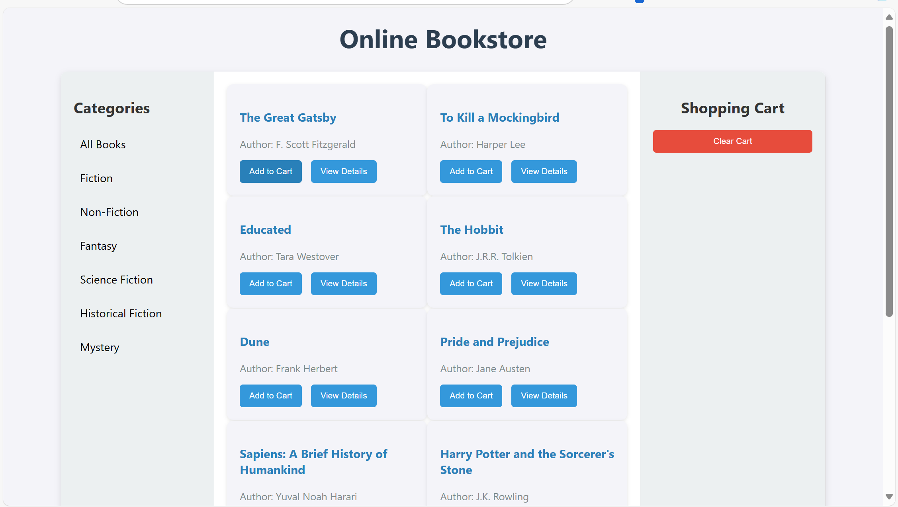

Here’s the updated assignment and documentation that uses `addEventListener` for all event handling instead of `.onclick`.

---

# **Assignment: Online Bookstore**

In this assignment, you will enhance an online bookstore webpage by adding functionality to interact with the books and the shopping cart. You will complete the functionality using JavaScript's `getElementsByClassName` and `addEventListener` methods. Follow the instructions carefully and ensure you adhere to the use of the specified language features.

---

## ** Part 1: Category Filter Button**
 - Add the javascript code the category buttons so that, when clicked only the books for that category are displayed on the page

4. **For-Loops**  
   - Loops through collections such as HTMLCollections. Unlike arrays, HTMLCollections don’t have array methods like `forEach()`, so a `for` loop is needed to iterate over them.
   - [For-loops on MDN](https://developer.mozilla.org/en-US/docs/Web/JavaScript/Reference/Statements/for)

---
## **Day 2**
BrowserStorage

- [x] To keep building from our starting point in yesterday's lab, COPY your src folder into this repo.

- [] Implement localStorage in your app so that you data from 1 page can persist and carry over to another.

- [] When creating a new order, the Order Page should use JSON.stringify() and localStorage.setItem()

- [] If continuing an existing order, JSON.parse() and localStorage.getItem() should be used to access the previous configuration

- [] The view page should use JSON.parse() and localStorage.getItem() to access the order and display it's contents on screen.